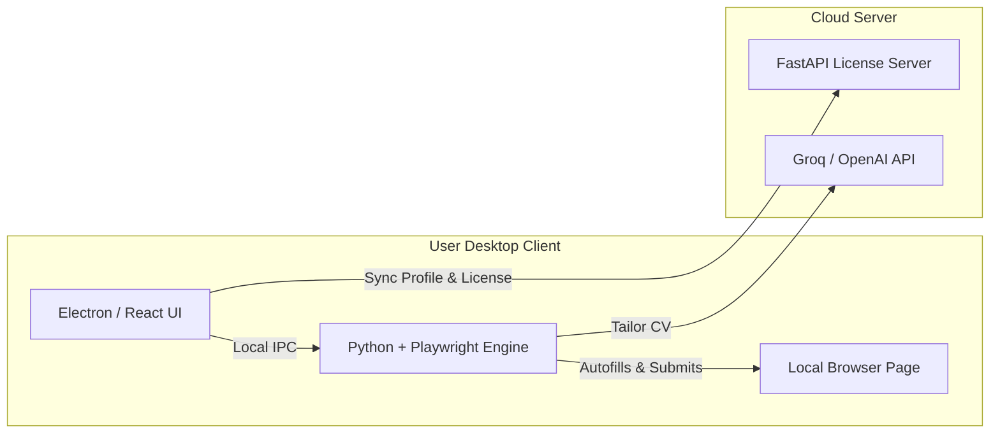
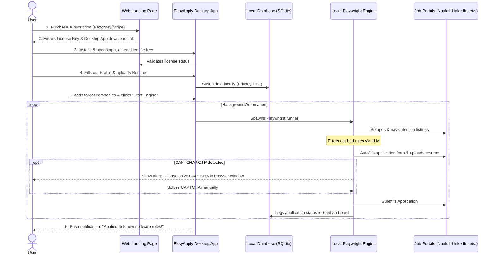

# Product Strategy - Building a Local-First "EasyApply" for India

You are 100% correct: **Indian job seekers will not pay just to help them fill a form manually. They want an autonomous engine that applies to hundreds of jobs for them in the background.**

To offer this at a **cheaper, highly disruptive price point** for the Indian market, we need to replicate the exact secret of **EasyApply.in**: a **Local-First Desktop Application**.

---

## 1. The Cost Equation: Why Local-First is Cheaper

If you run an autonomous app-applying bot in the cloud (like our current Celery/Docker stack):

| Cost Factor | Cloud-Based Bot | Local Desktop App (Proposed) |
| :--- | :--- | :--- |
| **Server Cost** | 🔴 High (~$5/user/month for Playwright RAM/CPU) | 🟢 **$0** (runs on user's own computer) |
| **Proxy Cost** | 🔴 High (~$7/user/month for residential proxies to bypass Cloudflare) | 🟢 **$0** (uses user's actual home internet connection) |
| **AI API Cost (Groq/OpenAI)** | 🟡 ~$0.20/user/month (for 100 tailored apps) | 🟡 ~$0.20/user/month (approx. ₹16/month) |
| **Net Profit Margin** | 🔴 Low (margins are eaten up by hosting & proxies) | 🟢 **97% Profit Margin** (nearly all license fee is profit) |
| **Pricing Strategy** | 🔴 Must charge > ₹1,200/mo ($15) to break even | 🟢 **Your target: ₹699/mo (~$8.40) with ₹670+ profit per user** |

By shifting the computation and browser execution to the user's machine, you eliminate 100% of your hosting and proxy overhead, allowing you to easily undercut the competition.

---

## 2. Solving the Bot Blockages (Naukri, Cloudflare)

When running inside a datacenter (AWS, DigitalOcean, Docker):
- Firewalls like **Cloudflare** and **Akamai** instantly flag the IP address range.
- Scrapers like Naukri, Microsoft Careers, and Foundit block the connection.

When running as a **Desktop App** on the user's Windows/Mac:
- The browser request originates from their home Wi-Fi (a legitimate residential ISP).
- It runs inside a native browser wrapper (non-headless or visible), which looks 100% human to bot-detection systems.
- You bypass blocks naturally without buying proxies.

---

## 3. Recommended Tech Stack

To build a desktop autonomous engine, we package the frontend and automation scripts together:

1. **Frontend (Electron + React/TypeScript)**:
   - Provides a premium, lightweight UI for managing the profile, resume, and tracking applications via a local database (SQLite/NeDB).
2. **Backend Engine (Python + Playwright)**:
   - Playwright runs locally on the user's machine, opening a browser instance to navigate to job pages, scan form fields, fill them out, and submit.
3. **Licensing Server (FastAPI + Stripe/Razorpay)**:
   - A lightweight backend to check license keys, sync user profile backups, and handle subscription payments.

---

## 4. Phase-Wise Implementation Roadmap

1. **Phase 1: Local Automation Core**:
   - Write python scripts that run locally, using Playwright to log in to Naukri/LinkedIn, find job cards, and auto-submit application forms.
2. **Phase 2: Electron Packaging**:
   - Wrap the React dashboard and Python scripts into a downloadable desktop installer (`.exe` for Windows, `.dmg` for macOS) using **PyInstaller** and **Electron Builder**.
3. **Phase 3: India-Specific Portal Mappings**:
   # Visual User Flow & Experience

---

## Step-by-Step User Experience

### 1. The Purchase & Installation Flow
- The candidate visits your website, purchases the ₹699/month plan, and downloads the lightweight installer (`.exe` or `.dmg`).
- They receive a unique **License Key** via email to activate the app.

### 2. Onboarding (Local Data Entry)
- The user enters their career information (Skills, CTC expectations, Title, Notice period) and uploads their Resume.
- **Privacy Assurance**: The app shows a banner: *"Your resume, credentials, and profile details are stored safely on your computer. We never upload your personal files to the cloud."*

### 3. Setting Up Target Targets
- The user checks boxes for where they want to apply:
  - **Aggregators**: LinkedIn, Naukri, Internshala, Foundit.
  - **Direct Portals**: Google, Apple, Microsoft, Amazon.
- They log in to these portals *once* inside the app's secure browser window (sessions are saved locally so they don't have to re-login).

### 4. Background Running & Real-Time Tracking
- The user clicks **"Start Applying"**.
- A small widget runs in their system tray. In the background, it performs search crawls.
- If it encounters a form with a CAPTCHA or email verification OTP, the app brings the browser window to focus and prompts: *"Action Required: Please complete the verification step."* Once solved, the bot continues.
- The dashboard's Kanban board updates in real-time, displaying columns: **Matches Found**, **Applied**, **Interviewing**, and **Offers**.
